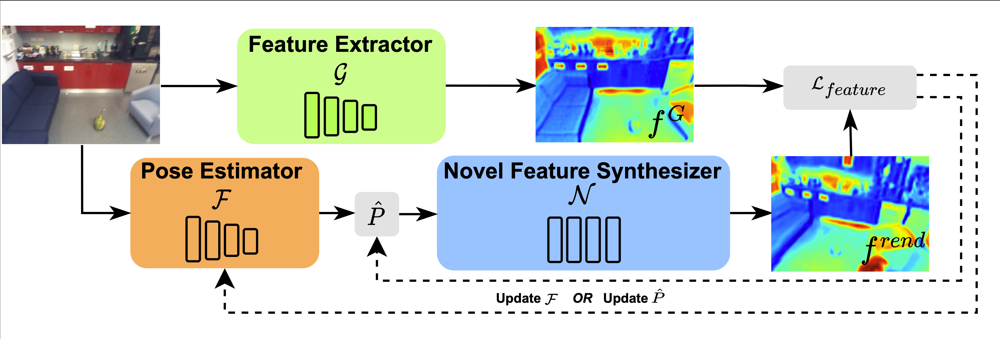
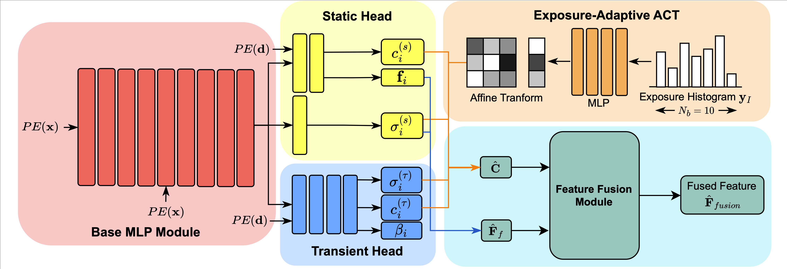

# Neural Refinement for Absolute Pose Regression with Feature Synthesis
**[Shuai Chen](https://scholar.google.com/citations?user=c0xTh_YAAAAJ&hl=en), 
[Yash Bhalgat](https://scholar.google.com/citations?user=q0VSEHYAAAAJ&hl=en),
[Xinghui Li](https://scholar.google.com/citations?user=XLlgbBoAAAAJ&hl=en), 
[Jiawang Bian](https://scholar.google.com/citations?user=zeGz5JcAAAAJ&hl=en&oi=sra),
[Kejie Li](https://scholar.google.com/citations?hl=en&user=JBwsoCUAAAAJ),
[Zirui Wang](https://scholar.google.com/citations?user=zCBKqa8AAAAJ&hl=en), 
and [Victor Prisacariu](https://scholar.google.com/citations?user=GmWA-LoAAAAJ&hl=en) (CVPR 2024)**

**[Project Page](https://nefes.active.vision) | [Paper](https://arxiv.org/abs/2303.10087)**

Code coming really soon...

[](https://arxiv.org/abs/2303.10087)
[](https://arxiv.org/abs/2303.10087)

## Installation

## Datasets

## Usage

## Publications
Please cite our paper and star this repo if you find our work helpful. Thanks!
```
@inproceedings{Chen_2024_CVPR,
  title={Neural Refinement for Absolute Pose Regression with Feature Synthesis},
  author={Chen, Shuai and Bhalgat, Yash and Li, Xinghui and Bian, Jia-Wang and Li, Kejie and Wang, Zirui and Prisacariu, Victor Adrian},
  booktitle={Proceedings of the IEEE/CVF Conference on Computer Vision and Pattern Recognition (CVPR)},
  month={June},
  year={2024},
  pages={20987-20996}
}
```
This code builds on previous camera relocalization pipelines, namely Direct-PoseNet and DFNet. Please consider citing:
```
@inproceedings{chen2022dfnet,
  title={DFNet: Enhance Absolute Pose Regression with Direct Feature Matching},
  author={Chen, Shuai and Li, Xinghui and Wang, Zirui and Prisacariu, Victor},
  booktitle={Proceedings of the European Conference on Computer Vision (ECCV)},
  year={2022}
}
@inproceedings{chen2021direct,
  title={Direct-PoseNet: Absolute pose regression with photometric consistency},
  author={Chen, Shuai and Wang, Zirui and Prisacariu, Victor},
  booktitle={2021 International Conference on 3D Vision (3DV)},
  pages={1175--1185},
  year={2021},
  organization={IEEE}
}
```
